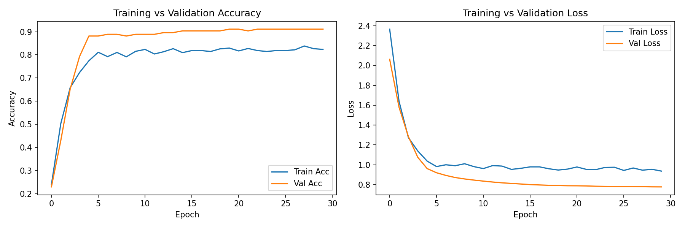
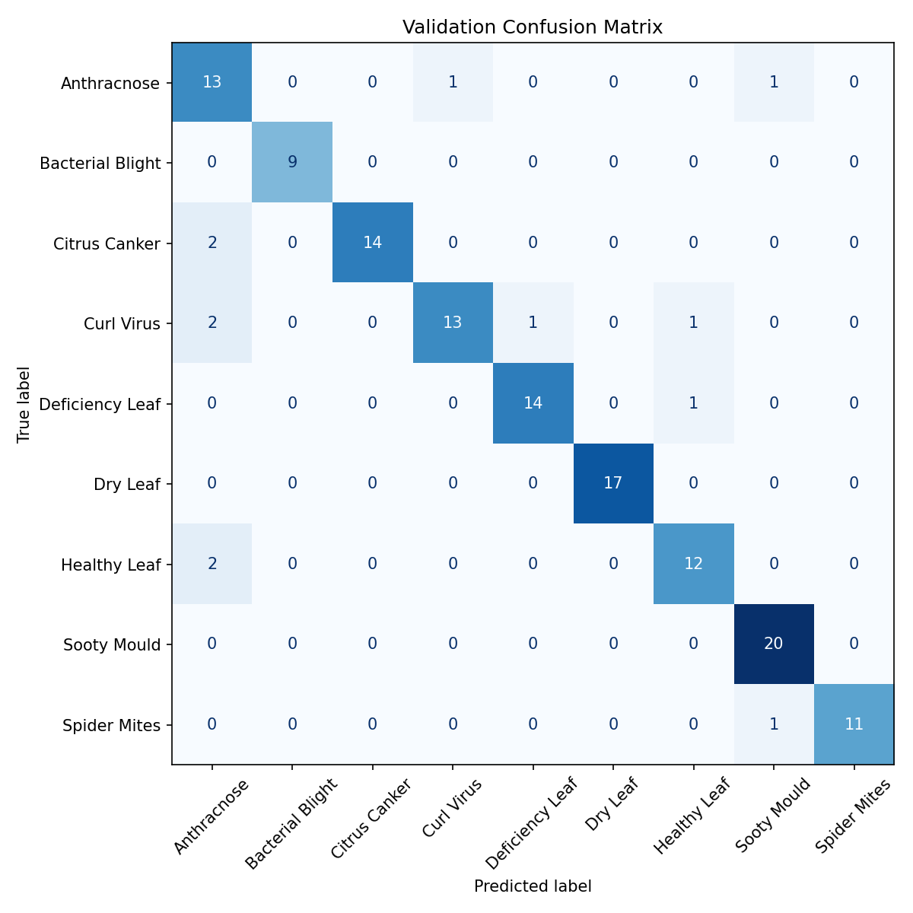

# Lemon Leaf Disease Detection using Fine-tuned DenseNet121

Fine-tune a CNN (DenseNet121) to classify lemon leaf diseases from the [LLDD - Lemon Leaf Disease Dataset](https://www.kaggle.com/datasets/).

## Dataset

- **Total images**: 1,354
- **Training split**: 1,219 images
- **Validation split**: 135 images
- **Image size**: 256 x 256
- **Classes** (9):

| # | Class |
|---|-------|
| 0 | Anthracnose |
| 1 | Bacterial Blight |
| 2 | Citrus Canker |
| 3 | Curl Virus |
| 4 | Deficiency Leaf |
| 5 | Dry Leaf |
| 6 | Healthy Leaf |
| 7 | Sooty Mould |
| 8 | Spider Mites |

## Model Architecture

**Backbone**: DenseNet121 (pre-trained on ImageNet)

```
Layer                    Output Shape          Param #
─────────────────────────────────────────────────────────
input_2                  (None, 256, 256, 3)         0
rescaling                (None, 256, 256, 3)         0
data_augmentation        (None, 256, 256, 3)         0
densenet121              (None, 8, 8, 1024)   7,037,504
global_average_pooling2d (None, 1024)                 0
batch_normalization      (None, 1024)             4,096
dropout                  (None, 1024)                 0
dense                    (None, 9)                9,225
─────────────────────────────────────────────────────────
Total params:      7,050,825  (26.90 MB)
Trainable params:     11,273  (44.04 KB)
Non-trainable params: 7,039,552 (26.85 MB)
```

## Training Pipeline

Two-phase training strategy:

1. **Warm-up** (5 epochs) — backbone frozen, only classifier head trains
2. **Fine-tuning** (25 epochs) — last ~79 layers of DenseNet121 unfrozen

### Hyperparameters

| Parameter | Warm-up | Fine-tuning |
|-----------|---------|-------------|
| Optimizer | Adam | Adam |
| Learning rate | 4e-4 | 1e-5 |
| Batch size | 32 | 32 |
| Label smoothing | 0.1 | 0.1 |
| Early stopping patience | — | 6 |
| ReduceLR patience | — | 3 |

### Data Augmentation (on-GPU)

- Random horizontal flip
- Random rotation (±8°)
- Random zoom (±20%)
- Random translation (±10%)

## Training Results

### Phase 1: Warm-up (Frozen Backbone)

| Epoch | Time (s) | Train Loss | Train Acc | Val Loss | Val Acc |
|-------|----------|------------|-----------|----------|---------|
| 1 | 49 | 2.3668 | 0.2395 | 2.0630 | 0.2296 |
| 2 | 45 | 1.6395 | 0.5029 | 1.5796 | 0.4296 |
| 3 | 47 | 1.2735 | 0.6579 | 1.2836 | 0.6519 |
| 4 | 45 | 1.1389 | 0.7235 | 1.0752 | 0.7926 |
| 5 | 45 | 1.0368 | 0.7744 | 0.9615 | **0.8815** |

### Phase 2: Fine-tuning (Unfrozen Top Layers)

| Epoch | Time (s) | Train Loss | Train Acc | Val Loss | Val Acc |
|-------|----------|------------|-----------|----------|---------|
| 1 | 47 | 0.9817 | 0.8113 | 0.9194 | 0.8815 |
| 2 | 45 | 0.9998 | 0.7925 | 0.8925 | 0.8889 |
| 3 | 44 | 0.9903 | 0.8105 | 0.8711 | 0.8889 |
| 4 | 44 | 1.0101 | 0.7916 | 0.8568 | 0.8815 |
| 5 | 44 | 0.9811 | 0.8154 | 0.8453 | 0.8889 |
| 6 | 44 | 0.9613 | 0.8236 | 0.8351 | 0.8889 |
| 7 | 42 | 0.9915 | 0.8039 | 0.8257 | 0.8889 |
| 8 | 43 | 0.9864 | 0.8138 | 0.8178 | 0.8963 |
| 9 | 42 | 0.9532 | 0.8269 | 0.8117 | 0.8963 |
| 10 | 42 | 0.9639 | 0.8097 | 0.8059 | 0.9037 |
| 11 | 42 | 0.9786 | 0.8187 | 0.8001 | 0.9037 |
| 12 | 43 | 0.9786 | 0.8187 | 0.7963 | 0.9037 |
| 13 | 42 | 0.9596 | 0.8146 | 0.7928 | 0.9037 |
| 14 | 42 | 0.9466 | 0.8261 | 0.7902 | 0.9037 |
| 15 | 43 | 0.9563 | 0.8294 | 0.7883 | **0.9111** |
| 16 | 43 | 0.9774 | 0.8171 | 0.7878 | 0.9111 |
| 17 | 41 | 0.9533 | 0.8277 | 0.7864 | 0.9037 |
| 18 | 41 | 0.9506 | 0.8187 | 0.7833 | 0.9111 |
| 19 | 41 | 0.9729 | 0.8146 | 0.7818 | 0.9111 |
| 20 | 41 | 0.9747 | 0.8187 | 0.7811 | 0.9111 |
| 21 | 42 | 0.9427 | 0.8187 | 0.7805 | 0.9111 |
| 22 | 42 | 0.9672 | 0.8220 | 0.7804 | 0.9111 |
| 23 | 42 | 0.9452 | 0.8384 | 0.7787 | 0.9111 |
| 24 | 42 | 0.9544 | 0.8269 | 0.7772 | 0.9111 |
| 25 | 42 | 0.9363 | 0.8236 | **0.7767** | 0.9111 |

## Final Performance Summary

| Metric | Value |
|--------|-------|
| Best validation accuracy | **91.11%** |
| Best validation loss | 0.7767 |
| Total training time | ~21.6 minutes (1,298 s) |
| Execution date | 2025-09-06 |

## Training Curves



## Confusion Matrix (Validation Set)



## Artifacts

All outputs saved in `outputs_20250906_142440/`:

| File | Description |
|------|-------------|
| `model_final.h5` | Final trained model (Keras) |
| `model_best.h5` | Best checkpoint (highest val_accuracy) |
| `model_final.onnx` | Exported ONNX model |
| `model_summary.txt` | Full model architecture summary |
| `training_curves.png` | Accuracy & loss plots |
| `confusion_matrix.png` | Normalized confusion matrix |

## Usage

```bash
# Train from scratch
python train2.py

# Run inference on a single image
python test.py

# Test ONNX export
python testOnnx.py

# Convert to ONNX
python ConvertOnnx.py
```
